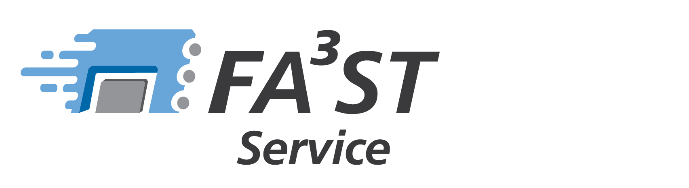

<div id="top"></div>


<!-- PROJECT LOGO -->

<br />
<div align="center">

<h3 align="center">FA³ST Service</h3>

<p align="center">
	Easy-to-use Asset Administration Shell Service

[**Explore the docs »**](https://github.com/FraunhoferIOSB/FAAAST-Service/tree/main/documentation)
<br />
[Report Bug](https://github.com/FraunhoferIOSB/FAAAST-Service/issues)
·
[Request Feature](https://github.com/FraunhoferIOSB/FAAAST-Service/issues)
</p>
</div>


<!-- TABLE OF CONTENTS -->
<details>
<summary>Table of Contents</summary>
<ol>
	<li>
	<a href="#about-the-project">About The Project</a>
	<ul>
		<li><a href="#built-with">Built With</a></li>
	</ul>
	</li>
	<li>
	<a href="#features">Features</a>
	<ul>
		<li><a href="#HTTP-Endpoint-Interface">HTTP-Endpoint Interface</a></li>
		<li><a href="#http-example">Example</a></li>
	</ul>
	<a href="#getting-started">Getting Started</a>
	<ul>
		<li><a href="#prerequisites">Prerequisites</a></li>
		<li><a href="#installation">Installation</a></li>
	</ul>
	</li>
	<li><a href="#usage">Usage</a></li>
	<li><a href="#develop">Develop</a></li>
	<li><a href="#roadmap">Roadmap</a></li>
	<li><a href="#contributing">Contributing</a></li>
	<li><a href="#license">License</a></li>
	<li><a href="#contact">Contact</a></li>
	<li><a href="#acknowledgments">Acknowledgments</a></li>
</ol>
</details>


<!-- ABOUT THE PROJECT -->
## About The Project
FA³ST Service implements the Asset Administration specification from the platform Industrie4.0 and built up an easy-to-use AAS Service based on a custom AAS model instance.

<p align="right">(<a href="#top">back to top</a>)</p>


### Built With

* Java 11
* Maven

<p align="right">(<a href="#top">back to top</a>)</p>

<!-- FEATURES -->
### Features
<!-- HTTP-ENDPOINT -->
#### HTTP-Endpoint Interface

The HTTP-Endpoint allows accessing data and execute operations within the FA³ST-Service via REST-API.
The HTTP-Endpoint Interface is based on the document [Details of the Asset Administration Shell - Part 2](https://www.plattform-i40.de/IP/Redaktion/EN/Downloads/Publikation/Details_of_the_Asset_Administration_Shell_Part2_V1.html), _Interoperability at Runtime –
Exchanging Information via Application
Programming Interfaces (Version 1.0RC02)_' , November 2021 and the OpenAPI documentation [DotAAS Part 2 | HTTP/REST | Entire Interface Collection](https://app.swaggerhub.com/apis/Plattform_i40/AssetAdministrationShell-REST-API/Final-Draft), Nov, 11th 2021

For detailed information on the REST API see
[DotAAS Part 2 | HTTP/REST | Entire Interface Collection](https://app.swaggerhub.com/apis/Plattform_i40/AssetAdministrationShell-REST-API/Final-Draft), Nov, 11th 2021

In order to use the HTTP-Endpoint the configuration settings require to include an HTTP-Endpoint configuration, like the one below:
```json
{
	"endpoints": [
		{
			"@class": "de.fraunhofer.iosb.ilt.faaast.service.endpoint.http.HttpEndpoint",
			"port": 8080
		}
	]
}
```
<p align="right">(<a href="#top">back to top</a>)</p>

<!-- HTTP-EXAMPLE -->
##### Example HTTP/REST API Call
Sample HTTP-Call for Operation _GetSubmodelElementByPath_
using the parameters
 - _submodelIdentifier_: https://acplt.org/Test_Submodel (must be base64URL-encoded)
 - _idShortPath_: ExampleRelationshipElement (must be URL-encoded)

using the query-parameters _level=deep_ and _content=normal_.

> To avoid problems with IRIs in URLs the identifiers shall be BASE64-URL-encoded before using them as
parameters in the HTTP-APIs. IdshortPaths are URL-encoded to handle including square brackets.

```sh
http://localhost:8080/submodels/aHR0cHM6Ly9hY3BsdC5vcmcvVGVzdF9TdWJtb2RlbA==/submodel/submodel-elements/ExampleRelationshipElement?level=deep&content=normal
```

Returns a specific submodel element from the Submodel at a specified path
<p align="right">(<a href="#top">back to top</a>)</p>
<hr>

##### The following interface URLs are fully supported:
* Asset Administration Shell Repository Interface
	* /shells (GET, POST)
	* /shells/{aasIdentifier} (GET, PUT, DELETE)
* Asset Administration Shell Interface
	* /shells/{aasIdentifier}/aas (GET, PUT)
	* /shells/{aasIdentifier}/aas/asset-information (GET, PUT)
	* /shells/{aasIdentifier}/aas/submodels (GET,POST)
	* /shells/{aasIdentifier}/aas/submodels{submodeIdentifier} (DELETE)
* Submodel Repository Interface
	* /submodels (GET, POST)
	* /submodels/{submodelIdentifier} (GET, PUT, DELETE)
* Submodel Interface
	* /submodels/{submodelIdentifier}/submodel (GET, PUT)
	* /submodels/{submodelIdentifier}/submodel/submodel-elements (POST)
	* /submodels/{submodelIdentifier}/submodel/submodel-elements/{idShortPath} (GET, POST, PUT, DELETE)
	* /submodels/{submodelIdentifier}/submodel/submodel-elements/{idShortPath}/invoke (POST)
	* /submodels/{submodelIdentifier}/submodel/submodel-elements/{idShortPath}/operation-Results/{handle-Id} (GET)
* Concept Description Repository Interface
	* concept-descriptions (GET, POST)
	* concept-descriptions/{cdIdentifier} (GET, PUT, DELETE)

<p align="right">(<a href="#top">back to top</a>)</p>

##### The following interface URLs are currently not (yet) supported:
* Submodel Repository Interface (Alternative Interface URLs "Swagger Doc Feb. 2022",
  [DotAAS Part 2 | HTTP/REST | Asset Administration Shell Repository](https://app.swaggerhub.com/apis/Plattform_i40/AssetAdministrationShell-Repository/Final-Draft#/Asset%20Administration%20Shell%20Repository/GetSubmodel) (yet not fully specified))
    * /shells/{aasIdentifier}/aas/submodels/{submodelIdentifier}/submodel
    * /shells/{aasIdentifier}/aas/submodels/{submodelIdentifier}/submodel/submodel-elements
    * /shells/{aasIdentifier}/aas/submodels/{submodelIdentifier}/submodel/submodel-elements/{idShortPath}
    * /shells/{aasIdentifier}/aas/submodels/{submodelIdentifier}/submodel/submodel-elements/{idShortPath}/invoke
    * /shells/{aasIdentifier}/aas/submodels/{submodelIdentifier}/submodel/submodel-elements/{idShortPath}/operation-results/{handleId}
* Asset Administration Shell Registry Interface (not in Scope of FA³ST-Service)	
* Submodel Registry Interface (not in Scope of FA³ST-Service)


* AASX File Server Interface (not yet supported)
    * /packages
    * /packages/{packageId}
* Asset Administration Shell Serialization Interface (not yet supported)
    * /serialization (GET)
* Asset Administration Shell Basic Discovery (not yet supported)
    * /lookup/shells
    * /lookup/shells/{aasIdentifier}

<p align="right">(<a href="#top">back to top</a>)</p>
<hr>

<!-- GETTING STARTED -->
## Getting Started

This is an example of how you may setting up your project locally.
To get a local copy up and running follow these simple example steps.

### Prerequisites

This is an example of how to list things you need to use the software and how to install them.
* maven
* java

### Installation

1. Clone the repo
```sh
git clone https://github.com/FraunhoferIOSB/FAAAST-Service
```
2. Install
```sh
maven package
```
3. Use needed classes as dependency in your project

<p align="right">(<a href="#top">back to top</a>)</p>


## Usage with Command Line

To start a FA³ST Service from the command line:
1. Move to the starter project and build the project
	```sh
	cd /starter
	mvn clean package
	```
2. Move to the generated `.jar` file
	```sh
	cd starter/target
	```
3. Execute the `.jar` file to start a FA³ST Service directly with a default configuration. Replace the `{path/to/your/AASEnvironment}` with your file to the Asset Administration Shell Environment you want to load with the FA³ST Service. If you just want to play around, you can use a example AASEnvironment from us [here](starter/src/test/resources/AASFull.json).
	```sh
	java -jar starter-{version}.jar -e {path/to/your/AASEnvironment}
	```

Currently we supporting following formats of the Asset Administration Shell Environment model:
- json
- json-ld
- aml
- xml
- opcua nodeset
- rdf

<hr>
<p>


Following command line parameters could be used:
```
-c, --configFile=<configFilePath>
						The config file path. Default Value = config.json
-e, --environmentFile=<aasEnvironmentFilePath>
						Asset Administration Shell Environment FilePath.
							Default Value = aasenvironment.*
	--emptyEnvironment   Starts the FA³ST service with an empty Asset
							Administration Shell Environment. False by default
	--endpoints[=<endpoints>...]

-h, --help               Show this help message and exit.
	--[no-]autoCompleteConfig
						Autocompletes the configuration with default values
							for required configuration sections. True by
							default
	--[no-]modelValidation
						Validates the AAS Environment. True by default
-V, --version            Print version information and exit.
```
<hr>
<p>

#### Change the Configuration
<p>

In general there are 3 ways to configure your FA³ST Service:
1. Default values
2. Commandline parameters
3. Environment Variables

The 3 kinds can be combined, e.g. by using the default configuration and customizing with commandline parameters and environment variables. If they conflict, environment variables are preferred over all and commandline parameters are preferred over the default values.

Without any manual customization a FA³ST Service with default configuration will be started. For details to the structure and components of the configuration please have a look at the configuration section [here]()

Default Configuration:
```json
{
	"core" : {
		"requestHandlerThreadPoolSize" : 2
	},
	"endpoints" : [ {
		"@class" : "de.fraunhofer.iosb.ilt.faaast.service.endpoint.http.HttpEndpoint"
	} ],
	"persistence" : {
		"@class" : "de.fraunhofer.iosb.ilt.faaast.service.persistence.memory.PersistenceInMemory"
	},
	"messageBus" : {
		"@class" : "de.fraunhofer.iosb.ilt.faaast.service.messagebus.internal.MessageBusInternal"
	}
}
```
<hr>
<p>


The FA³ST Service Starter consider following environment variables:
- `faaast.configFilePath` to use a own configuration file
- `faaast.aasEnvFilePath` to use a Asset Administration Environment file

Environment variables could also be used to adjust some config components in the configuration:
- `faaast.configParameter.[dot.separated.path]`

If you want to change for example the requestHandlerThreadPoolSize in the core configuration, just set the environment variable `faaast.configParameter.core.requestHandlerThreadPoolSize=42`. To access configuration components in a list use the index. For example to change the port of the HTTP endpoint in the default configuration you can set the environment variable `faaast.configParameter.endpoints.0.port=8081`.

<hr>
<p>

You could also use properties to adjust configuration components with the `-D` parameter. To change the `requestHandlerThreadPoolSize` of the core component and the port of the http endpoint use
```sh
java -jar starter-{version}.jar -e {path/to/your/AASEnvironment}
-Dcore.requestHandlerThreadPoolSize=42 -Dendpoints.0.port=8081
```
<hr>
<p>

#### Special Parameters

The parameter `--endpoints` accepts a list of endpoints which should be started with the service. Currently supported is only `http`. So a execution of
```sh
java -jar starter-{version}.jar -e {path/to/your/AASEnvironment} --endoints http
```
leads to a FA³ST Service with the HTTP endpoint implemented in class `de.fraunhofer.iosb.ilt.faaast.service.endpoint.http.HttpEndpoint`.


<p align="right">(<a href="#top">back to top</a>)</p>

<!-- HOW TO DEVELOP -->
## Develop
### Spotless
The project uses *spotless:check* in the build cycle, which means the project only compiles if all code, *.pom and *.xml files are formatted according to the project's codestyle definitions (see details on [spotless](https://github.com/diffplug/spotless)).
You can automatically format your code by running

> mvn spotless:apply

Additionally, you can import the eclipse formatting rules defined in */codestyle* into our IDE.

<p align="right">(<a href="#top">back to top</a>)</p>


### Third Party License Usage Report
Generates a report of the licenses used in the subsystems (dependencies).
The report is stored in the directory ./documentation/third_party_licenses_report as a html page.
> mvn license:aggregate-third-party-report


<!-- ROADMAP -->
## Roadmap


See the [open issues](https://github.com/FraunhoferIOSB/FAAAST-Service/issues) for a full list of proposed features (and known issues).

<p align="right">(<a href="#top">back to top</a>)</p>


<!-- CONTRIBUTING -->
## Contributing

Contributions are what make the open source community such an amazing place to learn, inspire, and create. Any contributions you make are **greatly appreciated**.

If you have a suggestion that would make this better, please fork the repo and create a pull request. You can also simply open an issue with the tag "enhancement".
Don't forget to give the project a star! Thanks again!

1. Fork the Project
2. Create your Feature Branch (`git checkout -b feature/AmazingFeature`)
3. Commit your Changes (`git commit -m 'Add some AmazingFeature'`)
4. Push to the Branch (`git push origin feature/AmazingFeature`)
5. Open a Pull Request

<p align="right">(<a href="#top">back to top</a>)</p>


<!-- LICENSE -->
## License

Distributed under the Apache 2.0 License. See `LICENSE` for more information.

Copyright (C) 2022 Fraunhofer Institut IOSB, Fraunhoferstr. 1, D 76131 Karlsruhe, Germany.

You should have received a copy of the Apache 2.0 License along with this program. If not, see https://www.apache.org/licenses/LICENSE-2.0.html.

<p align="right">(<a href="#top">back to top</a>)</p>


<!-- CONTACT -->
## Contact

<p align="right">(<a href="#top">back to top</a>)</p>


<!-- ACKNOWLEDGMENTS -->
## Acknowledgments

* []()
* []()
* []()

<p align="right">(<a href="#top">back to top</a>)</p>
