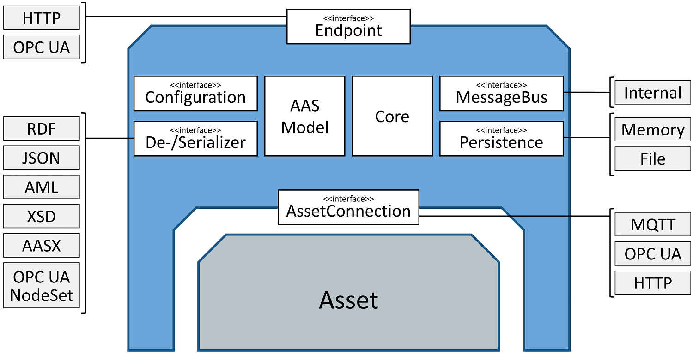

# Architecture

FA³ST Service uses an open architecture and defines interfaces for most functionality. This allows for easy extension by 3rd parties. However, FA³ST Service also includes one or more  useful default implementations for each interface:

-   [HTTP Endpoint](https://github.com/FraunhoferIOSB/FAAAST-Service/blob/main/endpoint/http/src/main/java/de/fraunhofer/iosb/ilt/faaast/service/endpoint/http/HttpEndpoint.java)
-   [OPC UA Endpoint](https://github.com/FraunhoferIOSB/FAAAST-Service/blob/main/endpoint/opcua/src/main/java/de/fraunhofer/iosb/ilt/faaast/service/endpoint/opcua/OpcUaEndpoint.java)
-   [Internal Message Bus](https://github.com/FraunhoferIOSB/FAAAST-Service/blob/main/messagebus/internal/src/main/java/de/fraunhofer/iosb/ilt/faaast/service/messagebus/internal/MessageBusInternal.java)
-   [MQTT Asset Connection](https://github.com/FraunhoferIOSB/FAAAST-Service/blob/main/assetconnection/mqtt/src/main/java/de/fraunhofer/iosb/ilt/faaast/service/assetconnection/mqtt/MqttAssetConnection.java)
-   [OPC UA Asset Connection](https://github.com/FraunhoferIOSB/FAAAST-Service/blob/main/assetconnection/opcua/src/main/java/de/fraunhofer/iosb/ilt/faaast/service/assetconnection/opcua/OpcUaAssetConnection.java)