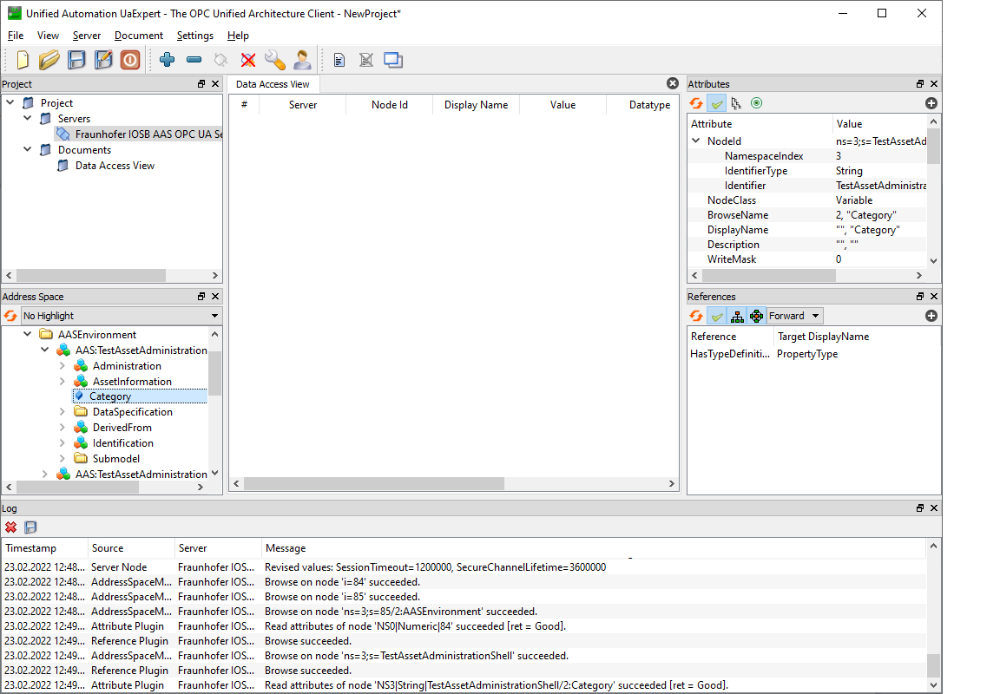

# OPC UA Endpoint
The OPC UA Endpoint allows accessing data and execute operations within the FA³ST Service via OPC UA.
For detailed information on OPC UA see
[About OPC UA](https://opcfoundation.org/about/opc-technologies/opc-ua/)

The OPC UA Endpoint is based on the [OPC UA Companion Specification OPC UA for Asset Administration Shell (AAS)](https://opcfoundation.org/developer-tools/specifications-opc-ua-information-models/opc-ua-for-i4-asset-administration-shell/).
The release version of this Companion Specification is based on the document [Details of the Asset Administration Shell - Part 1 Version 2](https://www.plattform-i40.de/IP/Redaktion/EN/Downloads/Publikation/Details_of_the_Asset_Administration_Shell_Part1_V2.html).

This implementation is based on [Details of the Asset Administration Shell - Part 1 Version 3](https://www.plattform-i40.de/IP/Redaktion/EN/Downloads/Publikation/Details_of_the_Asset_Administration_Shell_Part1_V3.html), which is currently not yet released.
Therefore, the current implementation is actually not compatible with the Companion Specification.

The OPC UA Endpoint is built with the [Prosys OPC UA SDK for Java](https://www.prosysopc.com/products/opc-ua-java-sdk/).
If you want to build the OPC UA Endpoint, you need a valid license for the SDK.

You can purchase a [Prosys OPC UA License](https://www.prosysopc.com/products/opc-ua-java-sdk/purchase/). As the OPC UA Endpoint is a server, you need a "Client & Server" license.

For evaluation purposes, you also have the possibility to request an [evaluation license](https://www.prosysopc.com/products/opc-ua-java-sdk/evaluate).

In order to use the OPC UA Endpoint, the configuration settings require to include an OPC UA Endpoint configuration, like the one below:
```json
{
	"endpoints": [
		{
			"@class": "de.fraunhofer.iosb.ilt.faaast.service.endpoint.opcua.OpcUaEndpoint",
			"tcpPort" : 18123,
			"secondsTillShutdown" : 5,
			"enableAnonymousAuthentication" : true,
			"discoveryServerUrl" : "opc.tcp://localhost:4840",
			"userMap" : {
			  "user1" : "secret"
			},
			"serverCertificateBasePath" : "PKI/CA",
			"userCertificateBasePath" : "USERS_PKI/CA"
		}
	]
}
```

OPC UA Endpoint configuration supports the following configuration parameters
-   `tcpPort` is the desired Port for the OPC UA TCP Protocol (opc.tcp). Default is 4840.
-   `secondsTillShutdown` is the number of seconds the server waits for clients to disconnect when stopping the Endpoint. When the Endpoint is stopped, the server sends a predefined event to all connected clients, that the OPC UA Server is about to shutdown. Now, the OPC UA Server waits the given number of seconds before he stops, to give the clients the possibility to disconnect from the Server. When `secondsTillShutdown` is 0, the Endpoint doesn't wait and stops immediately. Default is 2.
-   `enableAnonymousAuthentication` specifies whether anonymous access to the OPC UA Endpoint is enabled (True) or disabled (False). If anonymous access is disabled, only authenticated users have access to the OPC UA Endpoint. Default is True.
-   `discoveryServerUrl` is the URL which is used for registration with a discovery server. An empty String disables discovery server registration. Default is an empty String.
-   `userMap` is a map with user authentication credentials for the OPC UA Endpoint. The Key is the User Name, the Value is the Password. If the Map is empty, authentication with User Name and Password is disabled.  
-   `serverCertificateBasePath` is the path where the server application certificates are stored. Default is "PKI/CA". Below this path, further subdirectories are created. In "private" the certificates and private keys of the OPC UA Endpoint are saved. The filename of the base server application certificate is "Fraunhofer IOSB AAS OPC UA Server@ILT808_2048.der", the filename of the corresponding private key is "Fraunhofer IOSB AAS OPC UA Server@ILT808_2048.pem". If this application certificate doesn't exist, a self-signed certificate is automatically created on start. In "rejected" unknown (rejected) certificates from connecting clients are saved. In "certs" trusted certificates for clients are saved. To trust the certificate of a client, move it from "rejected" to "certs". In "crl" the certificate revocation list for a CA certificate saved in "certs" is saved. In "issuers/certs" the certificates of trusted CAs are saved. In "issuers/crl" the certificate revocation lists of the coresponding trusted CA certificates are saved.
-   `userCertificateBasePath` is the path where the certificates for user authentication are saved. Default is "USERS_PKI/CA". Below this path, further subdirectories are created. In "rejected" certificates from unknown (rejected) users are saved. In "certs" certificates for trusted users are saved. To trust the certificate of a user, move it from "rejected" to "certs". In "crl" the certificate revocation list for a coresponding CA certificate saved in "certs" is saved. In "issuers/certs" the certificates of trusted CAs are saved. In "issuers/crl" the certificate revocation lists of the coresponding trusted CA certificates are saved.

To connect to the OPC UA Endpoint, you need an OPC UA Client.
Here are some examples of OPC UA Clients:
-   [Unified Automation UaExpert](https://www.unified-automation.com/downloads/opc-ua-clients.html)
UaExpert is a free test client for OPC UA. A registration for the website is required.

-   [Prosys OPC UA Browser](https://www.prosysopc.com/products/opc-ua-browser/)
Free Java-based OPC UA Client. A registration for the website is required.

-   [Official Samples from the OPC Foundation](https://github.com/OPCFoundation/UA-.NETStandard-Samples)
C#-based sample code from the OPC Foundation.

-   [Eclipse Milo](https://github.com/eclipse/milo)
Java-based Open Source SDK for Java.

Here you can see a sample Screenshot with UaExpert.


## Supported Functions
-   Operations (OPC UA method calls). Exception: Inoutput-Variables are not supported in OPC UA.

-   Write Values
    -   Property
    -   Range
    -   Blob
    -   MultiLanguageProperty
    -   ReferenceElement
    -   RelationshipElement
    -   Entity

## Not (yet) Supported Functions
-   Events

-   Write Values
    -   DataSpecifications
    -   Qualifier
    -   Category
    -   ModelingKind

-   AASValueTypeDataType
    -   ByteString
    -   Byte
    -   UInt16
    -   UInt32
    -   UInt64
    -   DateTime
    -   LocalizedText
    -   UtcTime
