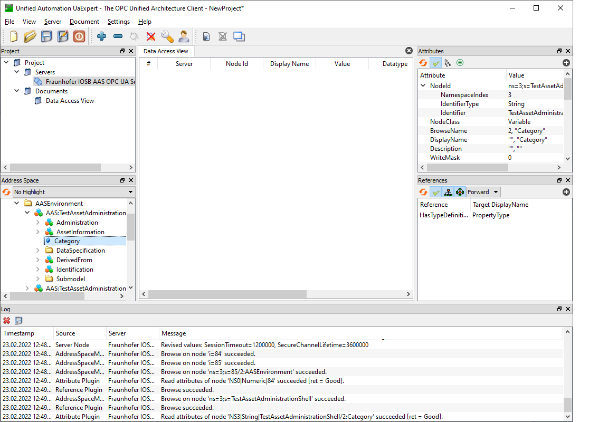

<!-- OPC UA ENDPOINT -->
### OPC UA Endpoint Interface
The OPC UA Endpoint allows accessing data and execute operations within the FA³ST-Service via OPC UA.
For detailed information on OPC UA see
[About OPC UA](https://opcfoundation.org/about/opc-technologies/opc-ua/)

The OPC UA Endpoint is based on the [OPC UA Companion Specification OPC UA for Asset Administration Shell (AAS)](https://opcfoundation.org/developer-tools/specifications-opc-ua-information-models/opc-ua-for-i4-asset-administration-shell/).
The release version of this Companion Specification is based on the document [Details of the Asset Administration Shell - Part 1 Version 2](https://www.plattform-i40.de/IP/Redaktion/EN/Downloads/Publikation/Details_of_the_Asset_Administration_Shell_Part1_V2.html).

This implementation is based on [Details of the Asset Administration Shell - Part 1 Version 3](https://www.plattform-i40.de/IP/Redaktion/EN/Downloads/Publikation/Details_of_the_Asset_Administration_Shell_Part1_V3.html), which is currently not yet released.
Therefore, the current implementation is actually not compatible with the Companion Specification.

The OPC UA Endpoint is built with the [Prosys OPC UA SDK for Java](https://www.prosysopc.com/products/opc-ua-java-sdk/).
If you want to build the OPC UA Endpoint, you need a valid license for the SDK.

You can purchase a [Prosys OPC UA License](https://www.prosysopc.com/products/opc-ua-java-sdk/purchase/). As the OPC UA Endpoint is a server, you need a "Client & Server" license.

For evaluation purposes, you also have the possibility to request an [evaluation license](https://www.prosysopc.com/products/opc-ua-java-sdk/evaluate).

In order to use the OPC UA Endpoint, the configuration settings require to include an OPC UA Endpoint configuration, like the one below:
```json
{
	"endpoints": [
		{
			"@class": "de.fraunhofer.iosb.ilt.faaast.service.endpoint.opcua.OpcUaEndpoint",
			"tcpPort" : 18123,
			"secondsTillShutdown" : 5
		}
	]
}
```

"tcpPort" is the desired Port for the OPC UA TCP Protocol (opc.tcp).
"secondsTillShutdown" is the number of seconds the server waits for clients to disconnect when stopping the Endpoint.
When the Endpoint is stopped, the server sends a predefined event to all connected clients, that the OPC UA Server is about to shutdown. Now, the OPC UA Server waits the given number of seconds before he stops, to give the clients the possibility to disconnect from the Server.
When "secondsTillShutdown" is 0, the Endpoint doesn't wait and stops immediately.

To connect to the OPC UA Endpoint, you need an OPC UA Client.
Here are some examples of OPC UA Clients:
-   [Unified Automation UaExpert](https://www.unified-automation.com/downloads/opc-ua-clients.html)
UaExpert is a free test client for OPC UA. A registration for the website is required.

-   [Prosys OPC UA Browser](https://www.prosysopc.com/products/opc-ua-browser/)
Free Java-based OPC UA Client. A registration for the website is required.

-   [Official Samples from the OPC Foundation](https://github.com/OPCFoundation/UA-.NETStandard-Samples)
C#-based sample code from the OPC Foundation.

-   [Eclipse Milo](https://github.com/eclipse/milo)
Java-based Open Source SDK for Java.

Here you can see a sample Screenshot with UaExpert.


## Supported Functions
-   Operations (OPC UA method calls). Exception: Inoutput-Variables are not supported in OPC UA.

-   Write Values
    -   Property

    -   Value

    -   Range

    -   Min
        -   Max

    -   Blob

    -   Value

    -   MultiLanguageProperty

    -   Value

    -   ReferenceElement

    -   Value

    -   RelationshipElement

    -   First
        -   Second

    -   Entity

    -   GlobalAssetID
        -   Type

## Not (yet) Supported Functions
-   Events (not yet supported)

-   Write Values (not yet supported)
    -   DataSpecifications
    -   Qualifier
    -   Category
    -   ModelingKind

-   AASValueTypeDataType (not yet supported)
    -   ByteString
    -   Byte
    -   UInt16
    -   UInt32
    -   UInt64
    -   DateTime
    -   LocalizedText
    -   UtcTime

<p align="right">(<a href="#top">back to top</a>)</p>
<hr>